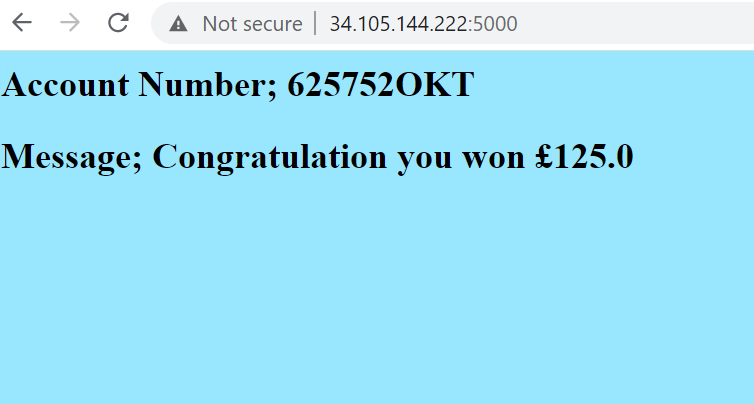
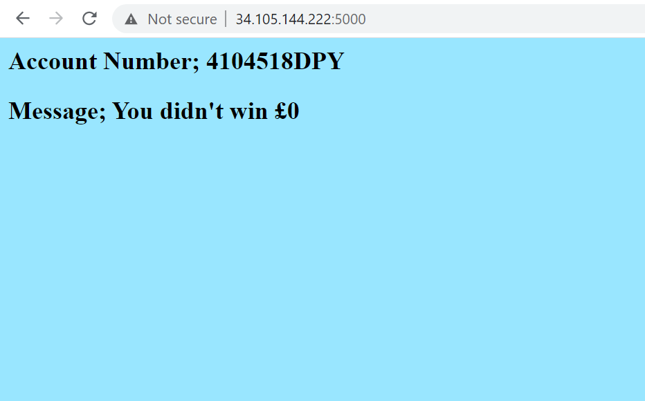
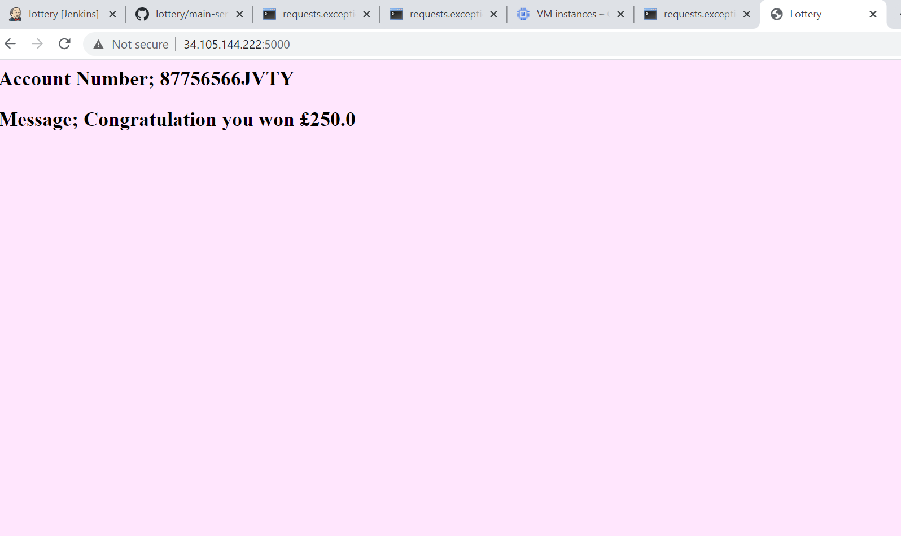
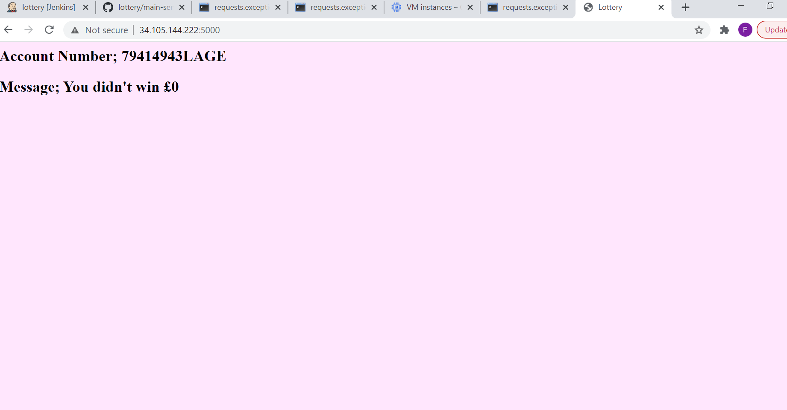
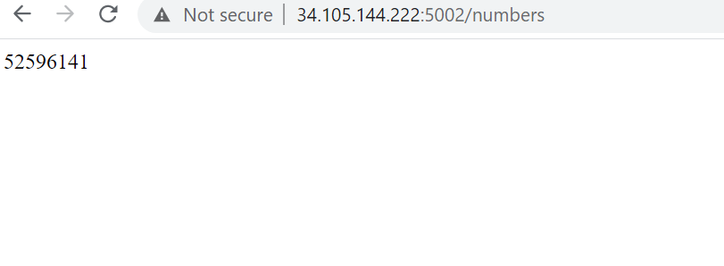
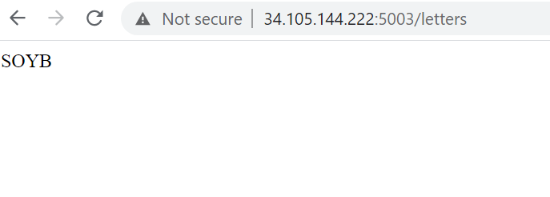
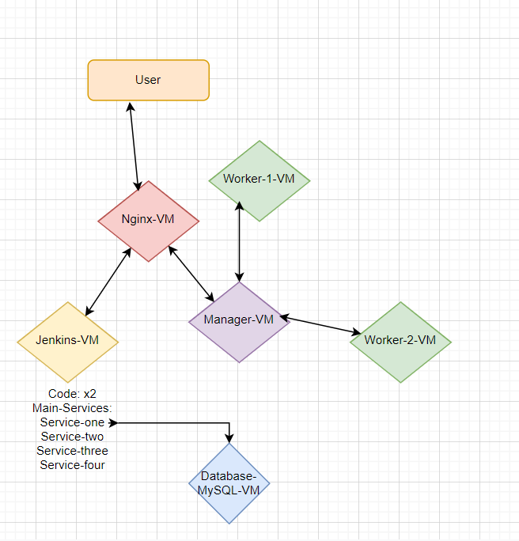
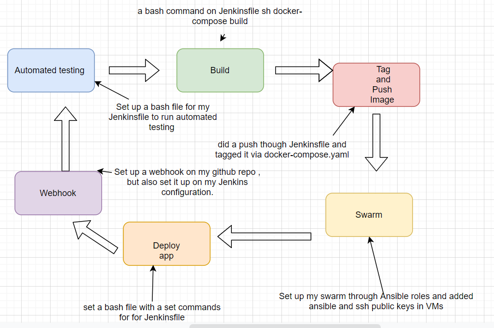
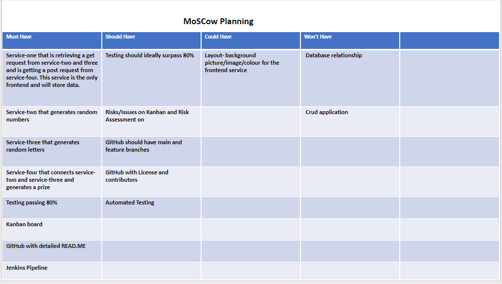

# Practical Project Specification

# **Lottery**

## **Objective:**

#### My overall objective for this project is to create four services that connect through docker swarm controlled through ansible and will be deployed via Jenkins. I decided to create an account number and prize generator. This entails that my service-one, which has a database will retrieve information from service-two and three as a get request as well as collect data from service-four. It will then ensure that the data generated in service-four is collected in a database. I will highlight each service function below in more detail.

## **Microservice:**

### **Service-one:**
#### Service-one for my application is the only front-end. Thus will retrieve all of the backend services and ensure that the generated account number and results are stored in a database. It will retrieve service-two which generates a set of random numbers and service-three which generates a set of random letters. It also has a post request of service-four which combines both numbers and letters and includes a message. The HTML page includes a background colour which is switched for demo purposes and the combined account number as well as a result message.

#### **Service-one on my main branch:**

#### **Service-one on my changed branch:**

### **Service-two:**
#### Service-two is one of the backend services. As mentioned above it generates 6/8 (6 on my main branch and 8 on my change-service branch) random numbers. 

#### **Service-two genrated numbers:**

### **Service-three:**
#### Service-three is also one of the backend services. It generates 3/4 (3 on my main branch and 4 on my change-service branch) random letters.

#### **Service-three genrated letters:**

### **Service-four:**
#### Service-four is the last backend service. It combines service-two and service-three and generates a combined account number as well as a message depending on whether the user won half of the lottery pot (£125 for the main branch and £250 changed-service branch) or did not win. 

## **Requirements:**

#### **The requirements for this project are as follows:**

#### * Kanban board via Trello.
#### * Risks and issue report detailed documentation via Kanban board and README.md.
#### *An Application fully integrated using the Feature-Branch model into a Version Control System which will subsequently be built through a CI server and deployed to a cloud-based virtual machine.
#### * Webhooks as I will be showing changes to my code and branch. Webhooks will be used so that Jenkins recreates and redeploys the changed application.
#### * Use of Service-orientated architecture. I will create four services one branch and changes made to the services on another branch.
#### * I will use Docker, which is a containerisation tool and Docker Swarm an orchestration tool through a stack command.
#### * I will use Nginx to create a reverse proxy to ensure one pathway to my application is created.
#### * I will create an Ansible Playbook that will supply the environment that my application needs in order to run.

## **Tech Stack:**

#### **The tech stack required would be the following:**

#### *Kanban Board via Trello

#### I choose to use a Trello Kanban board again for this project, as I had a great experience for my last project. I signed up for Asana, but I prefer the user experience on Trello more and end up picking it again.

#### *Version Control: GitHub

#### Github is a free repository that I am very familiar with. I have my previous project saved on the same account and it looks better to an employer that all projects are in one Github account. 

#### *Cloud server: GCP Compute Engine

#### This will be my second project using GCP as my cloud computing engine. The great thing about GCP is that it comes with free credits that should be used within 3 months. This gave me an opportunity to complete two projects and many more tutorials and exercises.

#### *Reverse Proxy: NGINX

#### This is my first time using NGINX in my project. I am using it as a load balancer for my swarm. The goal behind NGINX was to create a fast web server for handling a large number of concurrent connections. This will be useful for my project as I would like to show a change in my service, whilst it is deploying the load balancer will be able to ensure that the web browser is not stretched and breaks less. 

#### *Programming language: Python
#### *Front-end: Flask (HTML)
#### *Unit Testing with Python (Pytest)

#### I have so far only learned python as my oop. I am aware that it is a beginner-friendly and most common language. I will be using the flask library and pytest for my code.

#### *Database: MYSQL

#### This is the only database that I have picked up in my studies. MYSQL is an open-source/free database that is known for being reliable and compatible with all major hosting providers. I enjoyed it using MYSQL as I found it very easy to manage and use. 

#### *Containerisation: Docker

#### This was my first time using Docker for my project. Docker is an open-source containerization tool, useful for developers and system administrators as  offers a solution for differing system environments and provides the ability to keep environments consistent.

#### *Orchestration Tool: Docker Swarm

#### I set up a Docker Swarm through Ansible. Swarm is a container orchestration tool built into Docker that allows me to run a network of containers across multiple host machines, also known as nodes.

#### *CI Server: Jenkins

#### I used Jenkins for my deployment for this project. I set up a Jenkins pipeline for all my JenkinsFile stages to run though. Jenkins is a very popular free/open-source tool. 

#### *Configuration Management: Ansible

#### I used Ansible to set up my VM machines automatically. This entails that the machines would download all requirements I set in ansible automatically. I also used it to set up my swarm.

#### I used 

## **Architecture:**

#### **Architecture and Jenkins build:**

## **Project Management:**

### **Trello-Kanban board:**

#### [Please see a link to my Trello Kanban board](https://trello.com/b/ZAyQrDUN/lottery).

### **MoSCow Planning:**

 
## **Testing:**

#### I tested each of my services through pytest, coverage and missing terms. I have tested my code in VS Code and created a testing folder, which includes test_app.py and __init__.py files. There I have tested the URLs, the code running as for my number generator I used a patch test to ensure that the number generator was tested. Please feel free to look into my tests for more details.

#### I also set up automated testing in my Jenkins and it will run the following command for every single service: python3 -m pytest service_one --cov=service_one --cov-report=term-missing. That command runs all three tests that I highlighted above. 

#### I was short on time, but if more time was given I would ensure to run more tests such as more mock and patch testing and get even higher coverage.

### Service-one

### Service-two

### Service-three

### Service-four

## **Risk Assesment:**

## **Contributors/Reference:**

#### My contributors are: Dara Oladapoa and Harry Volker
#### I used QA-community for majority of the work, but also the below links for research purposes:
#### https://www.w3schools.com/python/python_lists_join.asp
#### https://www.w3schools.com/python/module_random.asp
#### https://www.kite.com/python/answers/how-to-generate-a-random-letter-in-python
#### https://www.w3schools.com/colors/colors_picker.asp?colorhex=80007a
#### https://www.w3schools.com/html/tryit.asp?filename=tryhtml_styles_background-color
#### https://www.w3schools.com/colors/colors_gradient.asp
#### https://docs.docker.com/engine/install/ubuntu/
#### Special thanks to Dara and Harry who acted as my traniners and guided me through lessons and my project. 