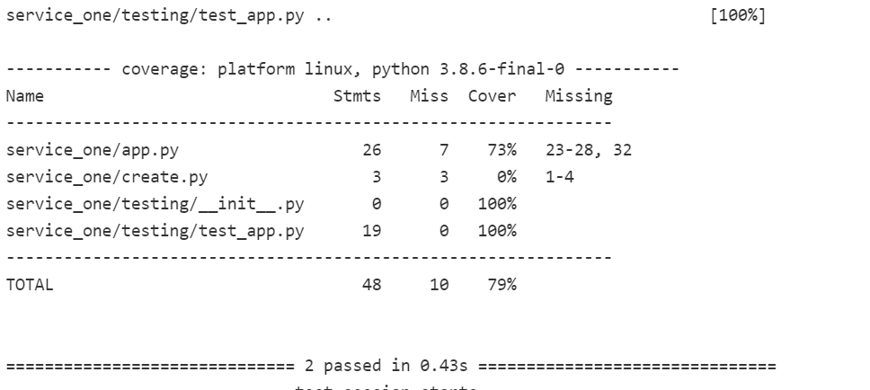

# Practical Project Specification

# **Lottery**

## **Objective:**

#### My overall objective for this project is to create four services that connect through docker swarm controlled through ansible and will be deployed via Jenkins. I decided to create an account number and prize generator. This entails that my service-one, which has a database will retrieve information from service-two and three as a get request as well as collect data from service-four. It will then ensure that the data generated in service-four is collected in a database. I will highlight each service function below in more detail.

## **Microservice:**

### **Service-one:**
#### Service-one for my application is the only front-end. Thus will retrieve all of the backend services and ensure that the generated account number and results are stored in a database. It will retrieve service-two which generates a set of random numbers and service-three which generates a set of random letters. It also has a post request of service-four which combines both numbers and letters and includes a message. The HTML page includes a background colour which is switched for demo purposes and the combined account number as well as a result message.

### **Service-two:**
#### Service-two is one of the backend services. As mentioned above it generates 6/8 (6 on my main branch and 8 on my change-service branch) random numbers. 

### **Service-three:**
#### Service-three is also one of the backend services. It generates 3/4 (3 on my main branch and 4 on my change-service branch) random letters.

### **Service-four:**
#### Service-four is the last backend service. It combines service-two and service-three and generates a combined account number as well as a message depending on whether the user won half of the lottery pot (£125 for the main branch and £250 changed-service branch) or did not win. 

## **Requirements:**

#### **The requirements for this project are as follows:**

#### * Kanban board via Trello.
#### * Risks and issue report detailed documentation via Kanban board and README.md.
#### *An Application fully integrated using the Feature-Branch model into a Version Control System which will subsequently be built through a CI server and deployed to a cloud-based virtual machine.
#### * Webhooks as I will be showing changes to my code and branch. Webhooks will be used so that Jenkins recreates and redeploys the changed application.
#### * Use of Service-orientated architecture. I will create four services one branch and changes made to the services on another branch.
#### * I will use Docker, which is a containerisation tool and Docker Swarm an orchestration tool through a stack command.
#### * I will use Nginx to create a reverse proxy to ensure one pathway to my application is created.
#### * I will create an Ansible Playbook that will supply the environment that my application needs in order to run.

## **Tech Stack:**

#### **The tech stack required would be the following:**

#### *Kanban Board via Trello
#### *Version Control: GitHub
#### *Cloud server: GCP Compute Engine
#### *Reverse Proxy: NGINX
#### *Programming language: Python
#### *Database: MYSQL
#### *Front-end: Flask (HTML)
#### *Unit Testing with Python (Pytest)
#### *Containerisation: Docker
#### *Orchestration Tool: Docker Swarm
#### *CI Server: Jenkins
#### *Configuration Management: Ansible

## **Architecture:**

#### **Architecture:**

## **Project Management:**

### **Trello-Kanban board:**

#### [Please see a link to my Trello Kanban board](https://trello.com/b/ZAyQrDUN/lottery).
 
## **Testing: **

### Service-one

### Service-two

### Service-three

### Service-four

## ** Risk Assesment: **

## **Contributors/Reference:**

#### My contributors are: Dara Oladapoa and Harry Volker
#### I used QA-community for majority of the work, but also the below links for research purposes:
#### https://www.w3schools.com/python/python_lists_join.asp
#### https://www.w3schools.com/python/module_random.asp
#### https://www.w3schools.com/python/ref_random_randint.asp
#### https://stackoverflow.com/questions/2257441/random-string-generation-with-upper-case-letters-and-digits/2257449
#### https://www.w3schools.com/colors/colors_picker.asp?colorhex=80007a
#### https://www.w3schools.com/html/tryit.asp?filename=tryhtml_styles_background-color
#### https://www.w3schools.com/colors/colors_gradient.asp
#### https://docs.docker.com/engine/install/ubuntu/
#### Special thanks to Dara and Harry who acted as my traniners and guided me through lessons and my project. 